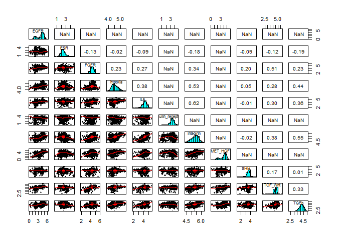

Selecting model cell lines for studying the phosphorylation signature of signaling pathways
================

This is the modified version of the original analysis. We applied for an R01 for studying the signature of phosphorylation pathway using the Kinobeads (Golkowski et al. 2017. JPR). We hope to find the specific phosphorylation pattern for a given signal pathway. For example, based on the RNA-seq data from CCLE and TCGA, FGFR and EGFR are often co-expressed, and in fact, a lot of the phosphorylation events are common between these two pathways. So can we deconvolute them using Kinobeads?

In the first version of this R01 application, we were criticized by choosing the model cell lines arbitrarily. To solve this, I analyzed the CCLE RNA expression data and chose cell lines based on their expression level of the pathway components. The pathway information was drawn from the reactome.org. The script can be found in <https://github.com/ht-lau/cells_for_pathway_analysis>

Fortunately, we are awarded the R01 after the revision (in a separated application cycle). To start the project, I re-visited the analysis and found that, using all of the pathway components as a guide can be a bad idea. For example, It is obvious that some of the cell lines can express the EGFR pathway components at a high level but do not express EGFR. This is also true for the other pathways. So I now think that using the expression of the essential component(s), e.g. the receptors, will be more appropriate.

Followings are the signaling pathways chosen. Description is the path to find them in reactome.org

EGF: Signal Transduction, Signaling by RTKs, Signaling by EGFR \n
FGF: Signal Transduction, Signaling by RTKs, Signaling by FGFR HGF: Signal Transduction, Signaling by RTKs, Signaling by MET TGFb: Signal Transduction, Signaling by TGF-beta, Signaling by TGF-beta receptor IL6: Immune Sys, Cytokine Signaling, Signaling by IL, IL-6 WNTs: Signal Transduction, Signaling by WNT, TCF dependent signaling in response to WNT SHH: Signal Transduction, Signaling by Hedgehog Estrogen: Signal Transduction, Signaling by NR, ESR-mediated signaling Glucose: Signal Transduction, Signaling by RTK, Signaling by Insulin receptor Oxygen: Cell. responses to ext. stimuli, Cell. response to stress, hypoxia PPMs/ECM: Extracellular matrix organization, Integrin cell surface interactions

To visualize the number of genes in each pathway.


Load the gene expression data downloaded from CCLE. Then extract the pathway component genes with the expression data. Results in 11 list of pathway gene expression.

    ##             Ensembl Gene.names X22RV1_PROSTATE X2313287_STOMACH
    ## 1 ENSG00000223972.4    DDX11L1         0.00000         2.085369
    ## 2 ENSG00000227232.4     WASH7P      1753.92512      1603.648846
    ## 3 ENSG00000243485.2 MIR1302-11         3.78654         1.042685
    ## 4 ENSG00000237613.2    FAM138A         0.00000         1.042685
    ## 5 ENSG00000268020.2     OR4G4P         0.00000         0.000000
    ##   X253JBV_URINARY_TRACT
    ## 1               0.00000
    ## 2            1014.67418
    ## 3              17.62231
    ## 4              27.82470
    ## 5               2.78247

    ##                 Ensembl Gene.names X22RV1_PROSTATE X2313287_STOMACH
    ## 686  ENSG00000070831.11      CDC42       23735.545        33598.424
    ## 1534 ENSG00000085832.12      EPS15        9641.287         7476.048
    ## 2603  ENSG00000213281.4       NRAS        8716.614         8001.561
    ## 3266 ENSG00000160691.14       SHC1        5817.639        13340.106
    ## 5390  ENSG00000151694.8     ADAM17        2513.505         6194.589
    ##      X253JBV_URINARY_TRACT
    ## 686              19003.345
    ## 1534              2935.506
    ## 2603             12499.784
    ## 3266             34140.911
    ## 5390              6120.507

To select the cell line for studying a particular pathway, I will have to make sure that the essential pathway component(s) is expressed. For example, EGFR will have to be expressed in the cell chosen for studying the EGFR signaling; any of the FGFRs have to be expressed for the FGFR signaling model cells. My initial idea is to choose the cells with high essential gene expression. However, it may cause the pathway to be activated constitutively. To make sure the pathways are inducible thus can be controlled experimentally, I think a moderate/median expression will be more appropriate.

Write a function to do the selection.

``` r
# I made a table containing the essential genes in each pathway, e.g. EGFR in EGF signaling
essential <- read.delim("signaling_genes/essential_each_pathway.txt", stringsAsFactors = FALSE)
essential[1:5,]
```

    ##            Pathway       Gene
    ## 1    Reactome.EGFR       EGFR
    ## 2     Reactome.ESR        ESR
    ## 3    Reactome.FGFR       FGFR
    ## 4 Reactome.hypoxia        HIF
    ## 5     Reactome.IL6 IL6ST|IL6R

``` r
# write a funtion to filter out cells that do not meet a threshold expression of the essential genes
# Input argument will be the essential gene data frame, from above
# The gene expression data (ccle.pathways) is already in the function 
# This function will,
#   1. filter the cells, if retain.percentile is provided. Cells that do not meet the criteria will be filled with 0
#   2. Export the expression of the essential gene(s). If retain.percentile is not provided.

filter.essential.genes <- function(essential.df,        # essential genes df
                                   retain.percentile = NULL    # a length-of-two vector with 
                                                               # the lower and upper expression to be kept
                                                               # NULL will output the expression of the essential genes
                                   ) { 
  pathway <- essential.df["Pathway"]
  essential.gene <- essential.df["Gene"]
  # the expression data is a list of data frame
  # So just extract the pathway data frame that match the pathway name
  filtered.pathway <- ccle.pathways[[pathway]]
  
  # make a new data frame holding the essential gene expression
  essential.gene.expression <- filtered.pathway[grepl(x = filtered.pathway$Gene.names,
                                                      pattern = essential.gene), ]
  
  
  if (length(retain.percentile) == 0) {
    return(essential.gene.expression)
  } else {
    # I think the cells should be expressing the essential genes, but not over-expressing. 
    # Like EGFR will auto-phosphorylate then it will be very hard to turn off the signal.
    # I will test, and remove the cells that are not within the expression range.
  
    # t(apply()) here because i want to fill two columns. 
    # If I don't t(), apply() will fill up percent.5 before percent.6,
    # meaning that percent.5 will have 50 %-tile and 60 %-tile of gene 1 in row 1 and row 2
    # then gene 2 in row 3 and row 4, etc
    essential.gene.expression[, c("low.bound", "hi.bound")] <- t(apply(essential.gene.expression[, 3:1078],
                                                                      1, quantile, probs = retain.percentile))
    # Test expression that are out of range
    test.threshold <- as.data.frame(apply(essential.gene.expression[, 3:1078, drop = FALSE], 2,
                                          function(x) x < essential.gene.expression$low.bound |
                                            x > essential.gene.expression$hi.bound))
  
    # The test was to see what genes are out of the target range,
    # so TRUE will be things that I don't want, i.e. extract cell lines to remove
  
    # The problem is that apply() turn the 1 row data frames into 1 column and n rows df...
    # So I have to make a if... else to test and fix it
    if (ncol(test.threshold) < 2) {
      unwant.cells <- test.threshold[test.threshold[,1] == "TRUE", , drop = FALSE]
      unwant.cells <- row.names(unwant.cells)
    } else {
#      unwant.cells <- names(test.threshold)[apply(test.threshold, 
#                                                  2, function(x) all(x == "TRUE"))]
      unwant.cells <- names(test.threshold)[apply(test.threshold, 
                                                  2, function(x) sum(x == "TRUE")/length(x) >= 0.6)]
    }
  
    # impute the expression data with a very low number for the cells that will be removed 
    filtered.pathway[, unwant.cells] <- 0
  
    return(filtered.pathway)
    }

}
```

Filter the cells. Cells that are not selected for a pathway will have gene expression of 0.

``` r
# filtered cells will be for picking the cells to use. 
# Retain cells with essential gene expression between 0.4 and 0.6 percentile
filtered.reactomes <- apply(essential, 1, filter.essential.genes, retain.percentile = c(0.4, 0.6))
names(filtered.reactomes) <- sub(pattern = "Reactome.", replacement = "", x = essential$Pathway)

filtered.reactomes[[1]][1:6, 1:6]
```

    ##                 Ensembl Gene.names X22RV1_PROSTATE X2313287_STOMACH
    ## 686  ENSG00000070831.11      CDC42               0        33598.424
    ## 1534 ENSG00000085832.12      EPS15               0         7476.048
    ## 2603  ENSG00000213281.4       NRAS               0         8001.561
    ## 3266 ENSG00000160691.14       SHC1               0        13340.106
    ## 5390  ENSG00000151694.8     ADAM17               0         6194.589
    ## 5899  ENSG00000115904.8       SOS1               0         7898.336
    ##      X253JBV_URINARY_TRACT X253J_URINARY_TRACT
    ## 686                      0                   0
    ## 1534                     0                   0
    ## 2603                     0                   0
    ## 3266                     0                   0
    ## 5390                     0                   0
    ## 5899                     0                   0

Visualize the pathway component expression in the selected cells. And table the number of select cell in each pathway.

``` r
filtered.cells <- filtered.reactomes

filtered.cells <- lapply(filtered.cells, FUN = select, 3:1078)
filtered.cells.sumExp <- lapply(filtered.cells, function(x) data.frame(Sums = colSums(x)))

filtered.cells.sumExp <- Reduce(x = filtered.cells.sumExp, f = function(x,y) cbind(x,y))
names(filtered.cells.sumExp) <- names(filtered.reactomes)

filtered.cells <- filtered.cells.sumExp %>% 
  gather(key = "Pathways", value = "Sum.exp") %>%
  filter(Sum.exp != 0)

reactome.box <- ggplot(filtered.cells) +
  geom_boxplot(mapping = aes(x = Pathways, y = log10(Sum.exp))) +
  theme(axis.text.x = element_text(angle=45, hjust = 1),
        axis.title.x = element_blank(),
        panel.background = element_rect(colour = "black", fill = "white")) + 
  ggtitle("Sum expression of pathway components")

reactome.box
```


``` r
data.frame(table(filtered.cells$Pathways))
```

    ##                Var1 Freq
    ## 1              EGFR  216
    ## 2               ESR  384
    ## 3              FGFR   74
    ## 4           hypoxia  110
    ## 5               IL6  389
    ## 6  Insulin_receptor  216
    ## 7          Integrin   23
    ## 8           MET_HGF  216
    ## 9               SHH  391
    ## 10          TCF_Wnt   82
    ## 11             TGFb  384

Check the expression level of essential gene(s) in the selected cells in all of the CCLE cells. Box is the expression of the essential gene(s) in all cell lines. Each coloured dot is a selected cell line. Plotted is the sum of the essential gene(s) expression, e.g. FGFR pathway has FGFR1 - FGFR4, y-axis is the sum of all FGFR expression.

``` r
# extract the essential genes from the whole ccle data
pathway.genes.expression.list <- apply(essential, 1, filter.essential.genes)
pathway.names <- sub(pattern = "Reactome.", replacement = "", x = essential$Pathway)
num.of.genes <- sapply(pathway.genes.expression.list, nrow)
pathway.genes.expression <- Reduce(x = pathway.genes.expression.list, f = function(x,y) rbind(x,y))
names(pathway.genes.expression)[1] <- "Pathways"
pathway.genes.expression$Pathways <- rep(pathway.names, times = num.of.genes)

pathway.genes.expression <- pathway.genes.expression %>%
  gather(key = "Cells", value = "Expression", 3:1078)

# tidy up the selected cells for plotting
selected.cells.for.plotting <- lapply(picked.cells.expression, 
                                      function(x) filter(x, Can.be.used == "+") %>% select(1:2))
#selected.cells.for.plotting <- lapply(selected.cells.for.plotting, function(x) names(x)[3] <- "Gene.x")

num.of.cells <- sapply(selected.cells.for.plotting, nrow)
selected.cells.for.plotting <- Reduce(x = selected.cells.for.plotting, f = function(x,y) rbind(x,y))
selected.cells.for.plotting$Pathways <- rep(pathway.names, times = num.of.cells)
selected.cells.for.plotting <- selected.cells.for.plotting %>%
  select(-Can.be.used) %>%
  left_join(., pathway.genes.expression, by = c("Cells", "Pathways"))
  
# plot
p <- ggplot() +
  geom_boxplot(data = pathway.genes.expression, mapping = aes(x = Pathways, y = log10(Expression))) +
  geom_point(data = selected.cells.for.plotting, 
               mapping = aes(x = factor(Pathways), y = log10(Expression),
                             colour = Cells)) +
  xlab("Expression of pathway marker genes") +
  theme(axis.text.x = element_text(angle=45, hjust = 1),
        panel.background = element_rect(colour = "black", fill = "white"))

p + guides(colour = FALSE)
```


The export data contains the perentile of essential gene(s) expression, -3 = 0 - 5%, -2 = &lt;=25%, -1 = &lt;=40%, 0 = 40% - 60%, etc. So cells with 0 of a particular pathway should be chosen for that pathway.

    ##                                       Cells EGFR ESR FGFR hypoxia IL6
    ## X22RV1_PROSTATE             X22RV1_PROSTATE   -1   0   -1       0  -2
    ## X2313287_STOMACH           X2313287_STOMACH    0  -2    0      -1  -1
    ## X253JBV_URINARY_TRACT X253JBV_URINARY_TRACT    1   0    2       1   1
    ##                       Insulin_receptor Integrin MET_HGF SHH TCF_Wnt TGFb
    ## X22RV1_PROSTATE                      1       -2      -2   2       0   -3
    ## X2313287_STOMACH                     0       -1       0  -3       2    0
    ## X253JBV_URINARY_TRACT               -2        0       2   0      -2    0
    ##                       Num.of.medianExp
    ## X22RV1_PROSTATE                      3
    ## X2313287_STOMACH                     5
    ## X253JBV_URINARY_TRACT                4

I am wonder if there is any correlation between pathways, say FGFRs expression is correlated to EGFR expression? But no...

``` r
pathway.genes.sum.log <- apply(pathway.genes.sum[,2:12], 2, function(x) log10(x))
psych::pairs.panels(pathway.genes.sum.log)
```


